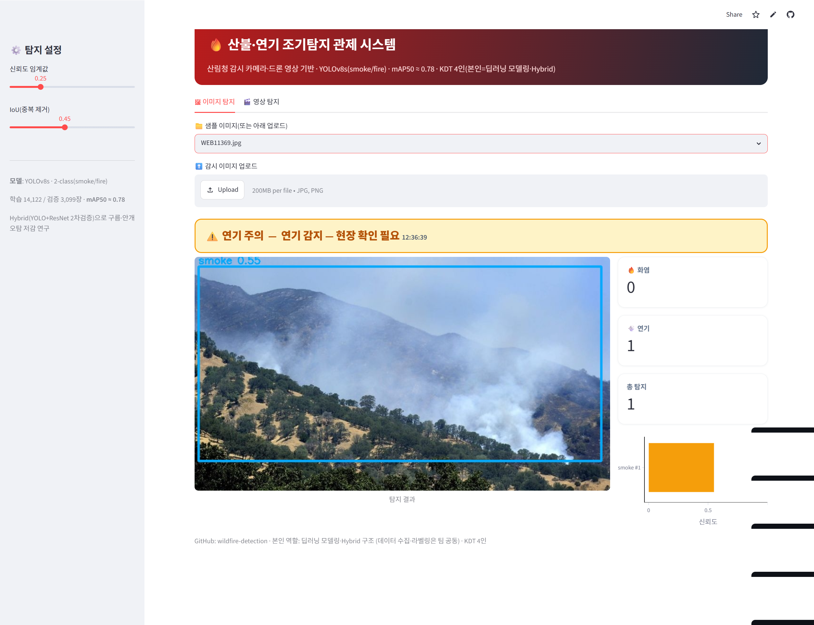
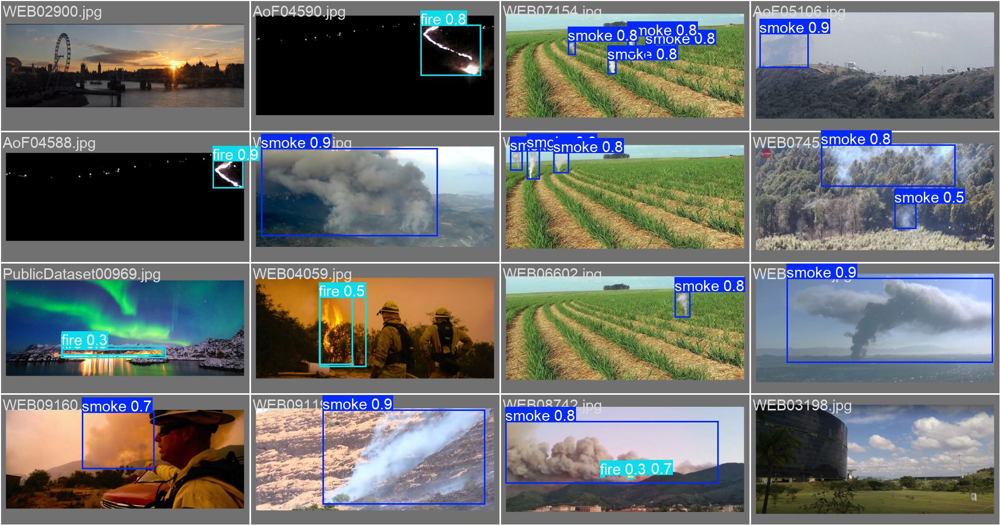
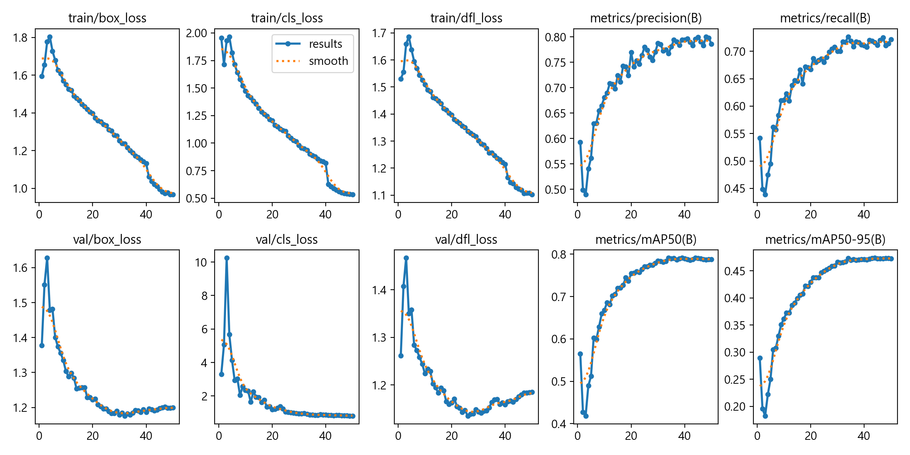
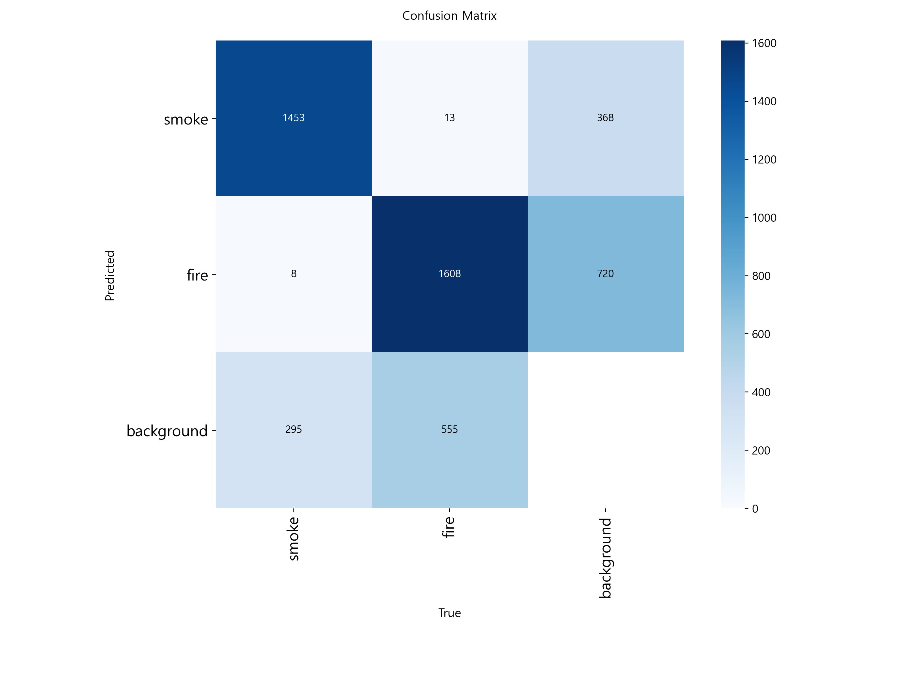

# 🔥 산불·연기 실시간 탐지 (YOLO + ResNet Hybrid)

[](https://wildfire-detection-magbcdezyjoskgcholyiyw.streamlit.app/)
[](https://huggingface.co/spaces/maxwell779/wildfire-detection)

**🤗 [실시간 YOLO 데모 (HF Spaces)](https://maxwell779-wildfire-detection.hf.space)** — 이미지 업로드·웹캠으로 실시간 탐지 · **🖥 [Streamlit 데모](https://wildfire-detection-magbcdezyjoskgcholyiyw.streamlit.app/)** — 관제 대시보드(정적, 항상 안정)



> 감시 영상에서 산불·연기를 실시간 탐지하되, **YOLO 후보를 ResNet으로 2차 검증하는 Hybrid 구조**로 구름·안개 오탐을 줄인 딥러닝 객체탐지 프로젝트.

| 항목 | 내용 |
|---|---|
| 기간 | 2026.03.24 ~ 2026.04.02 |
| 팀 | 4인 (KDT 팀 프로젝트) |
| **나의 역할** | **딥러닝 모델링·Hybrid 구조 담당** — YOLO/분류기 학습, Hybrid 검증 설계, 평가 |

> ℹ️ KDT 부트캠프 팀 프로젝트입니다. 본 저장소는 **본인(딥러닝 모델링) 작업** 중심으로 정리한 것이며, 데이터 라벨링·수집 등은 팀 공동 작업이었습니다.

---

## 🎯 문제 정의
단독 객체탐지기는 구름·안개·노을을 연기로 오인(오탐↑)해 경보 신뢰도가 떨어진다 → **실시간성을 유지하면서 오탐을 줄이는 검증 구조**가 필요.

## 🛠 기술 스택
`Python` · `PyTorch` · `YOLOv8 (s/m)` · `RT-DETR` · `ResNet50 / DeepCNN` · `SAHI` · `W&B`

## 🔧 핵심 구현
1. **탐지 학습** — YOLOv8s(30ep, mAP50 0.71) → YOLOv8m(50ep, mixup 0.15·copy_paste 0.1, **mAP50 ≈ 0.78**), RT-DETR-S 비교.
2. **2차 분류기 4종** — DeepCNN_640 / ResNet50의 3-class·4-class (4-class: DeepCNN **97.43%**).
3. **Hybrid 파이프라인** — YOLO 후보 박스 → 크롭 → ResNet 재분류로 배경 오탐 제거.
4. **증강 분리 설계** — 분류용 / 탐지용(bbox 동시 변환) 분리, **train에만** 적용해 검증셋 오염 방지 (`scripts/`).
5. **SAHI 타일 추론** — 먼 산불 연기(소형 객체) 보완.

## 🔧 트러블슈팅
| 문제 | 해결 |
|---|---|
| 구름·안개 오탐 | ResNet 2차 검증 Hybrid + **오탐 1,253장 hard negative 재학습** |
| 소형 객체 미탐지 | SAHI 슬라이스 타일 추론 |
| 라벨 모호(연기·불 동시/부재) | **4-class**(none/smoke_only/fire_only/both) 신설 |
| 증강이 평가 왜곡 | 분류/탐지 증강 분리 + train-only |
| **Hybrid 효과 검증** | 5변형을 단독 YOLO와 정량 비교 → **단독 YOLO를 못 넘음을 데이터로 확인**("복잡한 구조가 항상 답은 아니다") |

## 📈 결과
- YOLOv8m/l **mAP50 ≈ 0.78**, 4-class 분류 **97.4%**, hard negative 1,253장.
- 전체 실험 비교: [`final_model_comparison.csv`](final_model_comparison.csv) (60행).

## 📊 실험 결과 & 시각화

| 모델 | mAP50 | 비고 |
|---|---|---|
| YOLOv8s (30ep) | 0.71 | 베이스라인 |
| **YOLOv8m (50ep, mixup·copy_paste)** | **≈ 0.78** | 채택 |
| DeepCNN 4-class (2차 분류기) | 정확도 **97.4%** | 배경 오탐 제거 |
| Hybrid (YOLO+ResNet) 5변형 | 0.65~0.67 | 단독 YOLO 미만 → 기각 |

<p>
 
</p>
<p>
 
</p>

> 좌상: 실제 탐지 결과 · 우상: PR 곡선 · 좌하: 학습 곡선 · 우하: 혼동행렬

## 🖥 산림청용 관제 앱 (Streamlit) — 실모델 구동
**학습된 YOLOv8s로 이미지·영상에서 연기/불을 실제 탐지**하고 경보 단계(정상/연기 주의/화재 경보)를 산출.
```bash
pip install -r requirements.txt
streamlit run app.py
```
- 🖼 이미지 탐지: 박스 오버레이 + 화염/연기 카운트 + 경보 배너
- 🎬 영상 탐지: 프레임 샘플링 추적 + 화재 감지 프레임 집계

## 📁 구조
```
app.py                           # 산림청용 관제 앱 (실모델 YOLO 탐지)
models/fire_smoke_yolov8s.pt     # 학습된 YOLOv8s 가중치(smoke/fire) — 앱이 로드
wildfire_hybrid_modeling.ipynb   # 본인 작업: 탐지·분류·Hybrid 전 과정
final_model_comparison.csv       # 모델/조건별 실험 비교표
data.yaml                        # YOLO 데이터 설정
scripts/                         # 데이터 증강 패키지(팀 전달용으로 문서화)
requirements.txt
```
> 학습 데이터셋은 용량 관계로 제외했으나, **학습된 YOLOv8s 가중치를 포함**해 앱이 바로 실탐지합니다. 분류기(.pth)·전체 실행 산출물은 제외.
